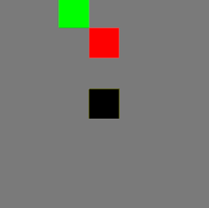
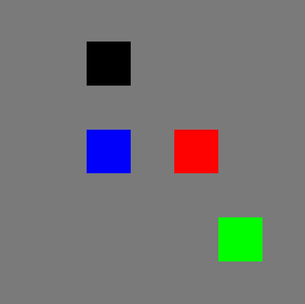
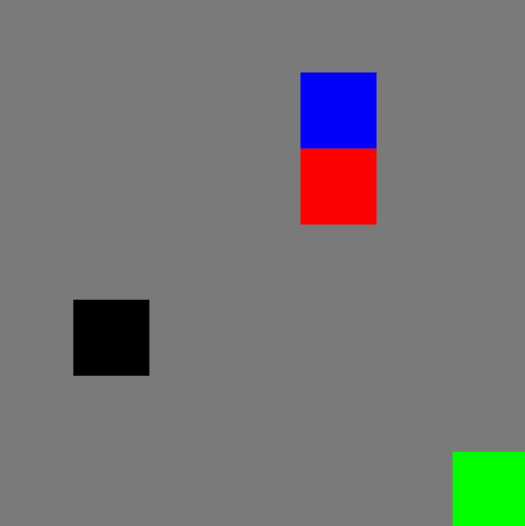
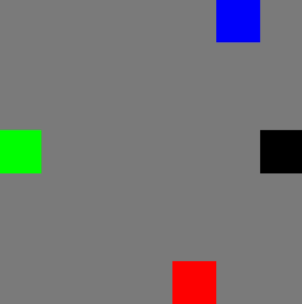
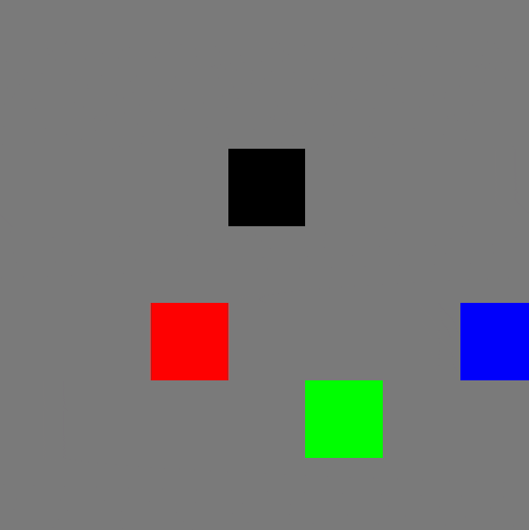
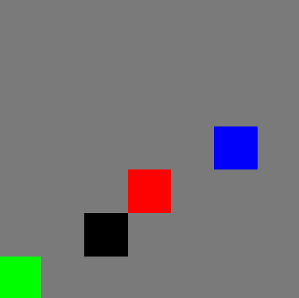
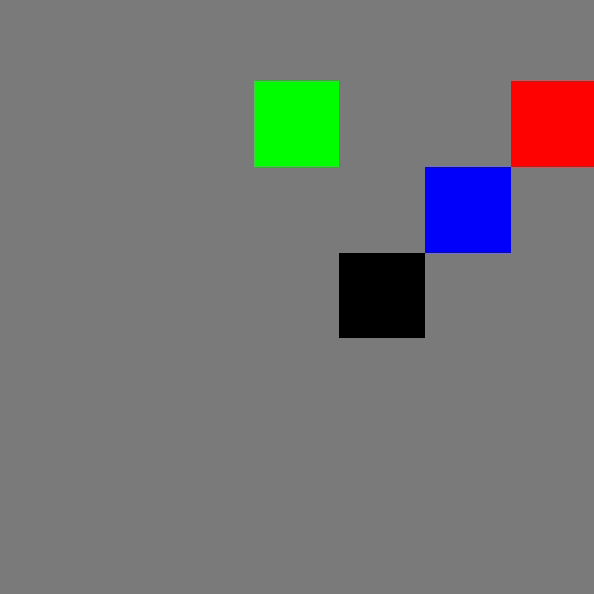
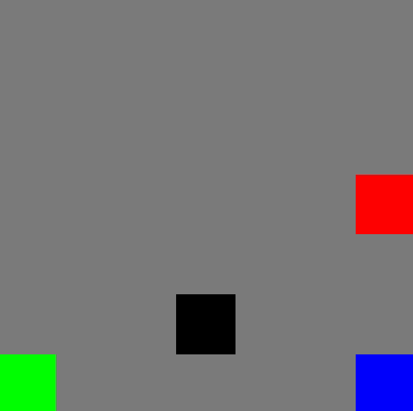
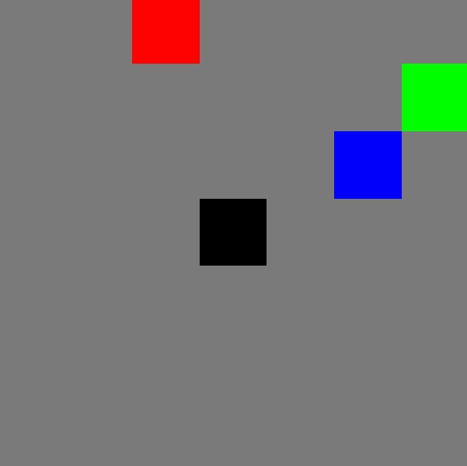

## gridroboman



An implementation of the \"gridroboman\" environments from the paper [\"Retrieval Augmented Reinforcement Learning\"](https://proceedings.mlr.press/v162/goyal22a.html).
Unlike the authors' original implementation, we do not use `pycolab`.

This suite of environments consists of a series of fully observable tasks with a common observation and action space. The agent (indicated with a black square) is on a 7x7 grid that contains a red, green, and blue object.

The agent can move up, down, left, and right, and also lift and put down objects. Objects that are lifted follow the agent until they are put down.

Objects can also be stacked on top of each other by putting down an object on the same tile as another object. If an agent performs the _lift_ action on a tile shared by multiple objects, the object on top will be lifted.

After 50 timesteps, environments are truncated.

### Observation Space

All environments have an observation of `Box(low=-1, high=7, shape=[11])` (i.e. an array of 11 elements between -1 and 7). More specifically, the elements correspond to the following pieces of information:

- 0: Agent x coordinate
- 1: Agent y coordinate
- 2: Red object x coordinate
- 3: Red object y coordinate
- 4: Red object status (-1 if below another object, 1 if held by the agent or on top of another object, 0 otherwise)
- 5: Green object x coordinate
- 6: Green object y coordinate
- 7: Green object status (-1 if below another object, 1 if held by the agent or on top of another object, 0 otherwise)
- 8: Blue object x coordinate
- 9: Blue object y coordinate
- 10: Blue object status (-1 if below another object, 1 if held by the agent or on top of another object, 0 otherwise)

### Action Space

There are 7 actions available (`Discrete(7)`), described here:

- 0: No-op
- 1: Move down (x, y - 1)
- 2: Move up (x, y + 1)
- 3: Move left (x - 1, y)
- 4: Move right (x + 1, y)
- 5: Lift object
- 6: Put down object

If an agent attempts to move into a wall, the action is automatically skipped. If the agent performs the _lift_ action on an empty tile or while it is already carrying an object, the action is also skipped. Finally, if the agent performs the _put_ action without actually holding onto an object, the action is skipped. These constraints are also encoded in the action mask.

### Info

Each environment's `info` dict consists of `action_mask`, a binary `ndarray` where elements set to 1 indicate the corresponding action should be masked out.

### Tasks

If you use gymnasium's `make` function, replace `X` and `Y` with "Red", "Green", or "Blue".

| Image | `make` name | Class Name | Description |
| -- | -- | -- | -- |
|                  | `Gridroboman-LiftX-v0`         | `LiftXEnv`                     | The agent must lift the correct object.|
|                | `Gridroboman-TouchX-v0`        | `TouchXEnv`                    | The agent must be directly adjecent to the correct object.|
|  | `Gridroboman-MoveXToCenter-v0` | `MoveXToCenterEnv`             | The agent must place the correct object in the center (3x3 area in the center of the grid).|
|  | `Gridroboman-MoveXToCorner-v0` | `MoveXToCornerEnv`             | The agent must place the correct object in any of the corners (any of the 4 2x2 in the corners).|
|      | `Gridroboman-TouchXWithY-v0`   | `TouchXWithYEnv`               | The agent must be directly adjacent to object X while holding object Y.|
|  | `Gridroboman-MoveXCloseToY-v0` | `MoveXCloseToYEnv`             | The agent must place objects X and Y next to each other, such that the distance between both objects in the X and Y directions do not exceed 1. |
|  |                                | `Gridroboman-MoveXFarFromY-v0` | `MoveXFarFromYEnv`| The agent must place objects X and Y away from each other, such that the Manhattan distance between the objects are greater than 9. |
|           | `Gridroboman-StackXOnY-v0`     | `StackXOnYEnv`                 | The agent must place object X on top of object Y.|

### Citation

If you use this code, reference the original paper:

```

@InProceedings{pmlr-v162-goyal22a,
  title = 	 {Retrieval-Augmented Reinforcement Learning},
  author =       {Goyal, Anirudh and Friesen, Abram and Banino, Andrea and Weber, Theophane and Ke, Nan Rosemary and Badia, Adri{\`a} Puigdom{\`e}nech and Guez, Arthur and Mirza, Mehdi and Humphreys, Peter C and Konyushova, Ksenia and Valko, Michal and Osindero, Simon and Lillicrap, Timothy and Heess, Nicolas and Blundell, Charles},
  booktitle = 	 {Proceedings of the 39th International Conference on Machine Learning},
  pages = 	 {7740--7765},
  year = 	 {2022},
  editor = 	 {Chaudhuri, Kamalika and Jegelka, Stefanie and Song, Le and Szepesvari, Csaba and Niu, Gang and Sabato, Sivan},
  volume = 	 {162},
  series = 	 {Proceedings of Machine Learning Research},
  month = 	 {17--23 Jul},
  publisher =    {PMLR},
  pdf = 	 {https://proceedings.mlr.press/v162/goyal22a/goyal22a.pdf},
  url = 	 {https://proceedings.mlr.press/v162/goyal22a.html},
}

```
